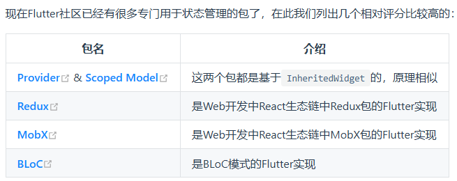

# 重新开始学习flutter2 - 2025年版

> 这里主要是逻辑部分

## 功能型组件

### 导航返回拦截

- WillPopScope 已经被废弃
- 使用 `PopScope` 包裹页面
- `PopScope` 有三个属性，`canPop`、`onPopInvoked(bool didPop)` 、`child`
- `onPopInvoked`有个参数 `bool didPop`，用 didPop 判断，是否已经后退了，一般来说 ，设置`canPop = true` ，然后 onPopInvoked中 `didPop=false` 的时候再做逻辑和操作
- 路由拦截，拦截的是默认的后退，比如后退手势。代码中的`Navigator.pop()`并不会被拦截

### 数据共享组件

`InheritedWidget`，级别相当于 StatelessWidget； 有一个钩子，`updateShouldNotify`

正常的StatefulWidget 有一个更新的钩子 - `didChangeDependencies`

### 状态共享 - `Provider`

这个截图和知识比较旧。新的推荐 `GetX` 这个状态管理包

### 按需rebuild

`ValueListenableBuilder` - 是个widget

- builder: 存放`变化的 widget` + `child 放这里使用`
- valueListenable: 被监听的数据
- child: 存放不变的widget

### 异步UI更新 

- FutureBuilder - 一次性的异步任务
- StreamBuilder - 流，或者说，多次读取数据的异步任务

### 对话框

- AlertDialog
- SimpleDialog
- Dialog
- ShowDialog / showGeneralDialog
- showModalBottomSheet

`context.markNeedsBuild()` 方法，可以让其稍后进入到rebuild刷新页面

注意，弹窗是个独立的Navigator，所以里面常态的setState，调不到父级的数据

## 事件处理与通知

- **点击**：`Listener` 是个Widget，可以监听手指和触摸简单点击；然后child渲染内容
- `AbsorbPointer` / `IgnorePointer`，可以让其虽然在点击区域内，但是**忽略指针事件** - 区别： `AbsorbPointer` 支持冒泡，干掉了捕获。另一个全都干掉了
- **手势**： `GestureDetector` / `GestureRecognizer`
- `GestureDetector` 通过 `onPanDown` + `onPanUpdate` + `onPanEnd` 可以实现滑动监听

## refer

- [flutter实战第二版](https://book.flutterchina.club/)