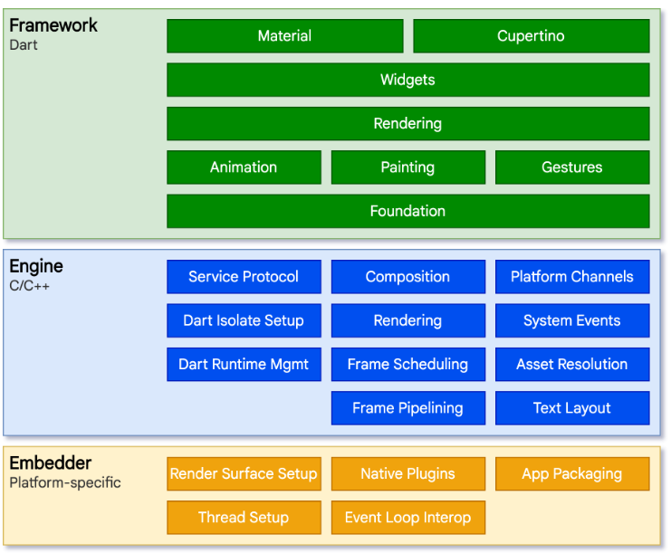

# 重新开始学习flutter - 2025年版


- React Native - Facebook(Meta)
- Flutter - Google


## flutter 前置介绍

1. 自绘引擎 - 既不是webview也不是原生控件，而是自己的Widget
   - 对比RN，要在Js和Native之间通信，重绘时开销大
2. 底层使用 `Skia` 作为其2D渲染引擎
3. `多平台支持` - 不仅仅是web、Android、iOS，还有pc端和Linux等

4. `高性能` - 语法为Dart语言，无需语法转换（diss RN)，开发时使用`JIT模式`，执行速度与JS差不多；release打包后是`AOT模式`，执行速度远超JS
5. `Dart语法特点` - 开发效率高；`AOT模式`支持高性能动画绘制；内存分配能力不输于chrome v8；是类型安全的语言（类似TS）


#### flutter框架解析




1. 框架层 - 类比为HTML+CSS + BOM,  自上而下，
   1. 可视组件， `Material（Material规范）`、`Cupertino(iOS设计规范)`、`Widget`；
   2. 不可视的`Rendering`（渲染树，类比虚拟dom树）
   3. 不渲染的、或者 功能性的组件，比如手势、动画等
2. 引擎层
   1. 各种引擎，比如Skia引擎、运行时引擎等，类比为JS
3. 嵌入层
   1. 可以理解为`平台抹平剂`，用来兼容不同平台


#### JIT & AOT

- AOT - `Ahead of time` - 提前编译 - 代表： C/C++
- JIT - `Just-in-time` - 即时编译 - 代表：JS/python

ps: python和dart类似，两种模式都支持


## Dart基本知识点

1. `var` 可以接收任何类型的变量，但是后期类型不可变，有点类似于JS的`const`
2. `dynamic`和 `Object`支持所有的类型，包括支持 Function和Null 类型。但是`Object`的api有限，`dynamic`支持所有的数据类型的所有的api
3. `final` 和 `const` ，用来定义一个永远不会改变的值（不只是类型，还有值）
   1. `final` 可以设置**运行时的常量**，比如 `final nowDate = DateTime.now()`，比如函数。而const不能
   2. `const` 是一个**编译时常量**，只支持 编译阶段 就已经确定的值
4. `null-safety` - **空安全**

```dart
int? i;
//... 别的地方给i赋值了

if (i != null) {
    int y = i! + 8 // 两步，1.判空； 2. i加上`!`符号告诉预处理器它没问题
}
```

补充： 同样支持语法糖， `str1?.length` `func?.call()` - 函数的可空需要额外加**call**

5. **函数**基本格式 `[TYPE] func () {}`，

   1. 如果不指定`[TYPE]`，默认返回值为`dynamic`，不像TS — 它没有类型推导。
   2. 只包含一个表达式的函数，可以简写为 `bool isTrue(bool param) => param;`
   3. 可选参数，放在`[]`内部，并且位于**最后面**，参考下例
   4. 参数可以**命名**，使用 `{param1...}` 同时位于 **最后面**，参考下例

   ```dart
   void func6(int p1, int p2, [int? p3, int? p4]) {}
   
   // Dart 2.12+版本中，命名参数，要么required，要么提供默认值
   void func7(int p1, int p2, {required int p3, int p4 = 4}) {}
   
   void useFunc() {
     func6(1, 2, 3);
     func7(1, 2, p3: 3, p4: 4);
   }
   ```

6. **mixin**，Dart不支持 `多个` 继承，但是支持添加多个`mixin` 来 ‘组合’ 成多个类
   1. class 写法 - `class Person { }`
   2. mixin 写法 - `mixin Eat { }` - 和class很像了
   3. 继承怎么写： `class Man extends Persion with Eat, Walk, Code { }`
   4. 可以一看到，extends继承一个**class**，但是 `with` 后面可以跟多个 **mixin**
7. **异步函数** - Future、Stream、async/await
   1. `Future` 很像 JS 中的 `Promise` 
      1. Future.delayed 启动，比如 `Future.delayed(Duration(seconds: 3), () {})`
      2. 返回的是`Future`，所以用 `.then` 、`.whenComplete` 续上
      3. `Future.wait([])` 类似 `Promise.all`
   2. `async` + `await` 消除回调地狱，用法和JS相同
      1. async位置细微差别： `task() async {}`
      2. await 后面不能跟同步表达式，必须是异步的，比如 返回值是`Future<void>` 或者带有 `async标识` 的函数 
   3. `Stream` 类似一个订阅监听，比如使用 listen 会多次触发内部callback
8. Dart vs Java vs JavaScript
   1. Dart在flutter项目中，在**GC-垃圾回收**层面可以做到10ms以内，不比Java差
   2. 跟JS比，emm...优势不大，毕竟JS有灵活的动态化，还有TS做类型检查


## Widget 知识点

1. 包，最基础的 `package:flutter/material.dart`- [Material设计](https://m2.material.io/design)

2. 应用入口

   ```dart
   // lib/main.dart
   void main() => runApp(MyApp())  // main函数自动被调用
   ```

3. StatefulWidget 由两部分组成 （没有代码，不理解可以继续往下读）
   1. `StatefulWidget` 类 - 类本身是不变的
   2. `State` 类 - 持有的状态会在widget生命周期中发生变化


### Widget 总览

widget只是描述一个UI元素的配置信息。真正的布局、绘制流程如下：

1. 根据 `Widget树` 生成一个 `Element 树` - extends `Element类`
2. 根据 `Element树` 生成 `Render树` - extends `RenderObject类`
3. 根据 `Render树` 生成 `Layer树` ，然后显示在屏幕上 - extend `Layer`类


1. Widget和Element是一一对应的。但是并不和 `RenderObject` 一一对应
2. 后续还会生成一棵 Layer树


### StatelessWidget

- 继承自 `Widget` ，重写了 `createElement` 方法
- build方法内有一个 `BuildContext context` 字段， context 是当前widget 在 整个widget数 中位置中 执行相关操作的一个handler - 理解为，它是**一棵树的节点**，可以**向上/自身** 查找数据


### StatefulWidget

- 类似于StatelessWidget；但是createElement返回的`Element对象`不同；而且多了个 接口 - `createState`
- createState 会被多次调用，每个用到这个组件的地方，都会调用一次createState，所以，状态是独立的
- 内部的子组件 - 也就是`createState` return的组件 - 我们称之为`State`，内部的状态更新想要触发页面渲染，通过 `setState(() {xxx})`
- 内部的子组件 - `State`，具备生命周期 - `initState`， `didUpdateWidget`， `deactive`， `dispose`， `reassemeble` `didChangeDependencies`， `build` 等
  - `reassemeble` 是专门开发模式下使用的，热重载时触发。release的包永远不会调用
  - `deactivate`  - Widget内容更新时触发 - 比如，父组件更新触发子组件更新
  - `dispose` State对象永久移除
  - TODO 不太对，搞不懂这个生命周期
- 在 `widget` 获取 `State对象`
  - 通过build参数 - `BuildContext context`对象获取； 补充一个点，如果希望读取暴露出来的方法，用`.of(context)` 去读取，比如 `Scaffold.of(context).[api]`  这样来读取想要的api
  -  通过`GlobalKey()` 获取 `static GlobalKey<ScaffoldState> _globalKey = GlobalKey()`，然后`_globalKey.currentState` 获取state对象

- 许多基础组件，比如`Column`， `Text` 是通过 自定义`RenderObject` 实现的。
  - 创建无子组件，继承 `LeafRenderObjectWidget`
  - 创建支持一个子的组件，继承 `SingleChildRenderObjectWidget`
  - 创建支持多个子的组件，继承 `MultiChildRenderObjectWidget`

- flutter 内置组件库
  - `package:flutter/widgets.dart`
    - `Text`， `Row` ， `Column` ， `Stack`，  `Positioned`，  `Container`等

  - `package:flutter/material.dart` - Material Design 设计规范
    - `Scaffold`，  `AppBar`，  `TextButton` 等

  - `package:flutter/cupertino.dart` - Cupertino 风格组件，适合iOS，但不止iOS
    - `CupertinoNavigationBar`，  `CupertinoButton`， `CupertinoColors` 等


## 状态管理

简单讲一下混合状态管理： 自己的状态直接读取；父组件的状态通过 `widget.xxx` 获取。 如下示例：

```dart
class ChildComp extends StatufulWidget {
	ChildComp({Key? key, required this.xxx}) 
	final bool xxx; // 接收父组件状态
	
	@override
	_ChildCompState createState() => _ChildCompState();
}

class _ChildCompState extends State<ChildComp> {
	bool yyy; // 维护自己的状态
	
	void func() {
	print(yyy); // 直接读取自己的状态
		print(widget.xxx) // 通过widget读取父组件的状态 
	}
}
```

其余的：全局状态管理

1. 自己实现一个全局的时间总线 - eventEmitter 类似；
2. 使用专门的状态管理的包，比如 Provider、 Redux，**get**
3. 我们团队用的就是[get](https://pub.dev/packages/get)


## 路由管理

- `MaterialPageRoute(builder: component)` 表示一个路由页面，继承自 `PageRoute` 类

- `Navagator` 提供了 **打开路由** 和 **退出路由** 的能力, `Future push(context, Route route)` + `bool pop(context, [ result])`

  - `Navigator.push( context, MaterialPageRoute(builder: xx) )`
  - `Navigator.pop(context, '我是返回值')`
  - `Navatigor.pushNamed(context, [route_name])` 配合下面的命名路由使用

- 命名路由

  - 路由表 `Map<String, WidgetBuilder> routes`
  - 注册进app，在 `MaterialApp(routes: routes) 即可
  - 我们团队用的是 `GetMaterialApp(getPages: routes)`

- 传递参数

  - `Navigator.of(context).pushNamed('new_page', arguments: 'hi')` - 设置参数

  - `ModalRoute.of(context).settings.arguments` - 获取参数

  - 适配routes

    ```dart
    MaterialApp(
      routes: {
          'page1': (context) {
              return NewPage(text: ModalRoute.of(context)!.settings.arguments)
          }
      }
    )
    ```

- 路由钩子 - 比如控制权限

  - `MaterialApp` 有个 `onGenerateRoute` 钩子，可以控制
  - `onGenerateRoute` 仅仅对 **命名路由** 生效

- 其他钩子： `navigatorObservers` 和 `onUnknownRoute`


## 包管理

> 把公共的 库 或者 SDK 打包起来。比如 Java 的 jar包，Android 的 aar包，Web中的 npm包


> Andrioid 通过Gradle 管理依赖；iOS 通过 Cocoapods / Carthage 管理依赖；Node 通过 npm 管理依赖； Flutter 使用配置文件 `pubspec.yaml` 管理

```yaml
# pubspec.yaml
name: flutter_project
descrpition: You see you, one day day.
version: 1.0.0+1
dependencies:
  flutter:
    skd: flutter
  cupertino_icons: ^0.1.2
  pkg1:
    path: ../../code/pkg1  # 这个是本地包，类似创建了alias
  
 dev_dependencies:
   flutter_test:
     skd: flutter
     
 flutter:
   uses-material-design: true
   assets:
     - xxx  # 见下一节
```


## 资源管理

在`pubspec.yaml`指定assets

```dart
flutter:
  assets:
    - assets/my_icon.png
    - assets/common/ # 获取common下面的所有图片资源，但是不能获取内部文件夹的
```


- 加载assets的图片 - 用 `AssetImage('path')`
- 加载依赖包内的图片，额外指定`package`字段
  - `AssetImage('icons/a.png', package: 'sdk_icons')`
  - `Image.asset('icons/a.png', package: 'sdk_icons')`


图片资源路径，比如`common/`，内部可以建立`子文件夹` 如`common/2.0x/a.png`， `common/3.0x/a.png`，这样就设备会自动处理分辨率，加载不同的`a.png`


## 调试app

- `debugger(when: [bool expression])`, `print` ， `debugPrint`
- `debugDumpApp()` - runApp后打印 **widget树**
- `debugDumpRenderTree()` - 打印 **widget渲染树** - 本质是调用 `RenderObject.toStringDeep`
- `debugDumpSemanticsTree()` 获取 **语义树**
- **统计应用启动时间**，使用 `flutter run --trace-startup --profile` 日志会记录在 `start_up_info.json` 中
- **记录执行时长** - `Timeline.startSync('xxx')` + `Timeline.finishSync()`


## flutter 异常捕获

- Dart 是 **单线程模型**，和 JS 类型，也是调用 **微任务队列** 和 **事件队列**
  - `Future.microtask()` 插入微任务
  - 所有的外部事件任务，基本都在事件队列中
- Flutter的错误日志，会一路触发，到 `FlutterError.onError`，所以改写这个方法，即可完成**定制化的错误日志上报**
- **同步语法**错误，可以用 `try{} catch (e) {}`
- **异步语法**错误，用`runZoned()` 包裹着我们的 `Page Widget`


----------------------------------------------------------------------


## flutter基础组件

- 文本
- 按钮
- 图片及icon
- 开关、多选
- 表单
- 进度条


### 文本

`Text` - 一段固定属性的文本

- style属性的值为 `TextStyle()`，里面的height表示行高，但是是比例的，比如1.5倍
- `TextStyle` 可以**拼接**，`TextStyle().merge(newTextStyle)`
- style无法设置宽高，所以设置`textAlign` 居中，只能在多行时才有效


`TextSpan` - 表示文本片段，用来拼接多彩的文本等等

- 里面有`text`、 `style` 属性，和`Text` 类似
- 多了个`children` 字段，可以继续拼接多个`Text`或者`TextSpan`

- 可被`Text.rich` 包裹，比如`Text.rich(TextSpan())`，富文本


`DefaultTextStyle` - 没错这也是一个widget，用来指定默认样式（所有的子节点都会继承）

- `style` 和 `child` 字段是 必填项


`字体` - 跳过


### 按钮

Material组件库的button有多种，都是直接或者间接的封装自 `RawMaterialButton`

- 所有按钮都有 `按下的水波动画` 和 `onPressed` 属性

- `ElevatedButton` - 漂浮按钮，按下后阴影会变大
- `TextButton` - 文本按钮，默认背景透明，按下后会有背景色
- `OutlinedButton` - 边框按钮，按下后边框变亮、出现背景和弱阴影
- `IconButton` - 纯icon的按钮，子属性为 `icon` 而非 `child`
- 最上面三种按钮都支持icon模式，比如 `TextButton.icon(icon, label, onPressed)`


### 图片及ICON

- `Image` - 图片的Widget版，内部`image` 属性 支持 `AssetImage(本地)` 和 `NetworkImage(远程)`
  - 子属性 `fit` 支持字段 - `fill`、 `cover`、 `contain` 、 `fitWidth/fitHeight`，默认为`null-居中且不缩放`
  - `color` + `colorBlendMode` -> 对每个像素进行混合处理
- `ImageProvider` - 是一个抽象类，并非Widget，类似 JS 的`new Image()`，`AssetImage` 和 `NetworkImage` 两个方法都继承自它
- image是带有缓存的，默认缓存数量为1000，最大缓存空间为100MB
- `IconData`  和 `Icon` 这两个都是用来显示 icon 的 **widget**


### 单选开关、多选

> Checkbox & Switch

1. 都继承自 `StatefulWidget`，但是内部无状态
2. 有两个重要属性：`bool? value` 和 `onChanged`
3. 尺寸大小都难以大改 - 截止当前，`Checkbox` 大小是固定的；`Switch`只能修改宽度
4. `Checkbox`有个属性`tristate`，表示是否为三态（也就是半选中状态)，此时value有三种状态 - `true`、 `false`、 `null` （null即为半选中横线）
5. 注意，Checkbox每个值也是 `bool?`，这意味着默认没有 `CheckboxGroup` 的概念，想要成组需要自己搭


### 表单、输入框

> Form & TextField

TextField

- 需要一个controller控制，`TextEditingController()` 创建，通过`controller.text` 获取用户输入的内容
- `maxLines` 输入的最大行数，默认为1，只设置 `maxLines` 不设置 `minLines`，好像会报错，反正这里有坑
- 监听有两种，一种是 `onChange`， 另一种是 `controller.addListener(() {})`
- 焦点的移动：创建`FocusScopeNode()` 控制器，让它`xx.requestFocus(FocusNode())`
- FocusNode 也可以做监听焦点变化 `focusNode.addListener(() {})`


Form

`Form + FormField` 进行表单的设计。`TextFormField` 是 `FormField` 的变种，内部有`validation` 这个方法


`Builder`也是个独立的`Widget`


### 进度指示器

- `LinearProgressIndicator` - 条状
- `CircularProgressIndicator` - 圆形
- 通过设置父容器尺寸来影响 两种指示器 的尺寸
- `CustomPainter` 定制进度指示条风格 


## 布局类组件

> Widget的继承关系： Widget > RenderObjectWidget > (Leaf / SingleChild / MultiChild)RenderObjectWidget


Flutter 有两种布局模型

1. 基于 `RenderBox` 的 **盒模型布局**
2. 基于`Sliver（RenderSliver）` 的 **按需加载列表布局**


- 线性布局 - `Row` | `Column`
- 弹性布局 - `Flex`
- 流式布局 - `Wrap` | `Flow`
- 层叠布局 - `Stack` | `Positioned`
- 对齐和相对定位 - `Align`
- 其他 - `LayoutBuilder` | `AfterLayout`


约束类容器：

 `ConstrainedBox` - 基础的约束组件，限制子组件 的 `最大/最小 的 宽/高` 这个widget，这个widget里面的`constraints` 属性是 `BoxConstraints` ，也就是我们常说的CSS

`constraint` - 单词含义 - 限制、约束

对应的自然有 `UnconstrainedBox` 这个widget

其他的，`SizedBox`, `AspectRatio` - 指定子组件的长宽比， `LimitedBox` - 指定最大宽高； `FractionallySizedBox` - 根据父容器宽高百分比设置子组件宽高


### 线性布局 （Row + Column）

- 继承自flex，其实就可以理解为css中的flex+direction

- 属性： `mainAxisAlignment` 主轴对齐（横轴）
- 属性： `crossAxisAlignment` 纵轴对齐
- 属性：`mainAxisSize` 设置如何侵占父容器主轴空间，只有两个值，`min`和`max`
- 特殊情况：如果`Row`里面嵌套`Row`，或者`Column`里面嵌套`Column`，那么`子Row/Column` 的默认`mainAxisSize=MainAxisSize.max` 失效，也就是撑不满了，需要中间填充一层`Expand`


### 弹性布局 （Flex、Expanded）

- `Flex`，弹性布局。`Row` 和 `Column` 是继承的`Flex` - 只是默认加上了`direction属性`而已，所以它俩也算Flex
- `Expanded` 只能作为Flex的child （Row or Column 当然也可以），否则不生效


### 流式布局（Wrap、Flow）

> 主要应对内容超出后溢出报错

- `Wrap`类似于`Flex`，会自动换行
- `Wrap` 属性： `spacing` - 子容器之间，在主轴（横轴）上的间距；`runSpacing` - 纵轴的；`alignment` - 纵轴方向的对齐方式
- `Flow` 很少用，它性能好，灵活。但是使用复杂，适合做动画等高性能场景
- `Flow` 必填的`delegate` 要实现一个很麻烦的类，计算好每个子所在的位置，并`paintChild()`，确实复杂，[示例参考](https://book.flutterchina.club/chapter4/wrap_and_flow.html#_4-5-2-flow)


### 层叠布局（Stack、Positioned）

> 应该叫它们`定位相关布局`，Web有定位，Android有`Frame布局`
>
> `Stack` 允许 子组件 **堆叠**
>
> `Positioned` 根据`Stack`的四个角确定位置

Stack 和 Positioned 它们是共同使用的，Stack提供一个随着父容器宽高的容器，Positioned 组件设置各个的位置。


### 对齐和相对定位` Align`、`Center`

> 它们都只支持一个child；它们都有 `widthFactor` ，`heightFactor`
>
> 一般，ParentWidget-> Align/Center -> ChildWidget，当`Parent`没有设置宽高的时候，`widthFactor 的数字N` 就是 `Child 的宽高的 N倍`； Parent设置了之后，`widthFactor`不生效；`heightFactor` 同理


#### Align - 属性 `alignment` - 两种属性值`Alignment` vs `FranctionalOffset`

- 简单的数值结论：`Alignment(dx, dy)`， 中心点在`0`，`FractionalOffset`，中心点在`0.5`；除此之外，认为是一模一样的即可，百分比的数值；都是`（parentSize - childSize) * 百分比`

- 对应的属性值`Alignment`，除了有快捷的`Alignment.topRight`等，还有细节定位，`Alignment(double dx, double dy)`，注意，这里的 dx、dy，范围值是 **[-1, 1]**才能在父盒子中。
- 属性值也可以是 `FractionalOffset（x, y）`， 我们认为是两个盒子，它是针对两个盒子的缝隙的位置偏移。比如，设置`pWidth=800.0, childWidth=400.0, x=0.5`，那么距离左侧 `left = (800 - 400) * 0.5 = 200.0` 

#### Center

没啥可说的，简单认为 Align 的 **强制居中** 版吧


### LayoutBuilder

**LayoutBuilder(builder: Fn)**

-  `Fn`的参数有 `(BuildContext context, BoxConstraints constraints)`， `constraints` 内部有父级的Widget的尺寸信息（又称约束） - 也就是宽高、最大/最小宽高
- 另外还可以用来打印一些信息


ps: build 和 layout 是可以交替执行的，也就是我们经常看到的，`child`里面包裹着`函数+builder`之类的啊


## 容器组件

- Padding - 填充
  - 属性padding - `EdgeInset` 是 `EdgeInsetsGeometry` 的一个子类，定义 `left/top/right/bottom/vertical/horizontal` 等
- DecoratedBox - 装饰容器
  - 属性decoration - `BoxDecoration` 是 `Decoration` 的一个子类，定义`border/bg/shadow/gradient` 等
- Transform - 变换 （ vs RotatedBox) 
  - 就是css中的transform，属性`Matrix4 transform`；同时它有直接用的子组件eg `Transform.rotate`等。
  - 应用在`绘制时（先布局，后绘制）`，所以`布局时`占用空间多少，`变换后`**空间不变**
  - `RotatedBox` 这个组件，功能相似，但是它的变换是在布局时，所以**空间会变化**
- Clip - 裁剪
  - 裁剪也是在 Paint 阶段，所以不会影响Layout的布局，所占的空间不会变化
- FittedBox - 空间适配
- Scaffold - 页面骨架
  - appBar/body/bottomNavigationBar/drawer 等等


List.generate(100) 创建长度为100的List；转换成Widget 使用 .cast();代码如下：

`List.generate(100, (v) => const Text('here')).toList().cast<Widget>()`


`context.size` 可以看到当前页面级模块(上下文)的尺寸，比如`Size(411.4, 912.0)`

## refer

- [flutter实战第二版](https://book.flutterchina.club/)