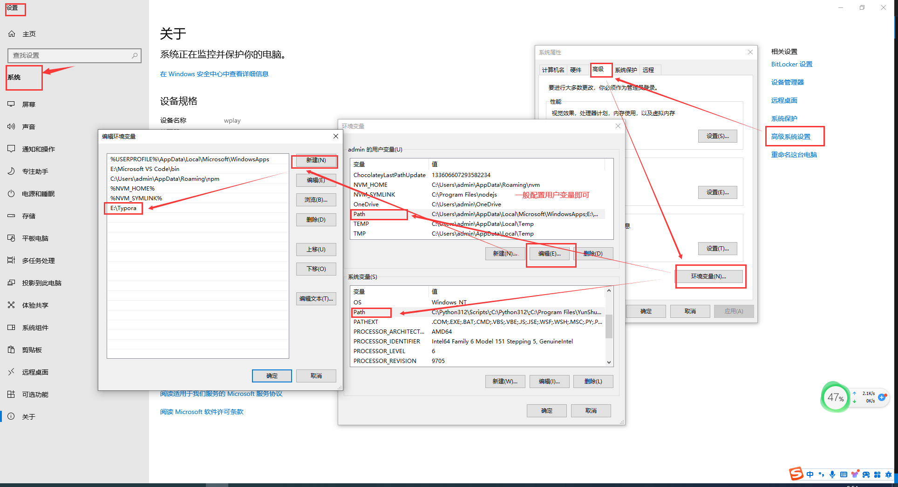
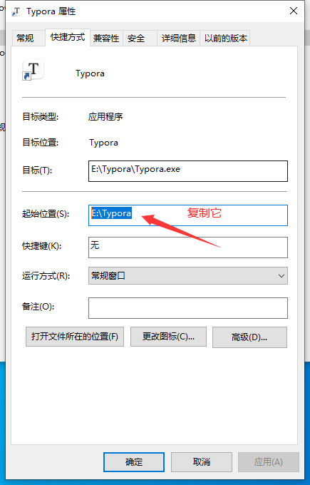

## 环境变量配置

> 因为windows中，vscode中添加Open in Typora插件，结果没生效，而引发的配置环境变量流程

windows下，vscode安装了 Open in Typora，但是没生效。因为windows比较特殊，可以安装在不同的位置。解决方案，添加环境变量

1. window10中寻找环境变量方式 - 打开控制面板 - 系统 - 高级系统设置 - 高级->环境变量 - （admin的用户/系统 变量随便你，一般选前者即可） -  点击path - 新建。

   如下图

   

2. 新建什么呢？当然是typora.exe所在的上级目录了。右键快捷方式查看它的快捷方式中的起始位置，复制即可

   如下图

​	

ps: 发现一个细节，配置完后，vscode关闭重新打开不生效，因为vscode进程可能没杀掉的缘故吧。**杀进程**、或者小白一些直接**重启**电脑，都能解决问题

[参考vscode open in typora plugin github](https://github.com/cyberbiont/vscode-open-in-typora/blob/HEAD/addToPATH.md)

